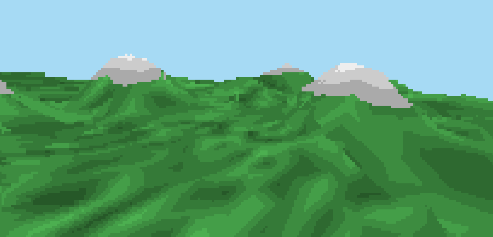

# V3D

3D rasterization library for ComputerCraft!

V3D lets you draw triangles in 3D with very good performance. The library
supports more advanced features like per-pixel depth testing, face culling,
fragment shaders, and perspective correct UV interpolation (that lets you use
textures).

The library is low-level and minimal, aimed at developers wanting to write high
performance 3D applications, or wanting to write a more general purpose and
capable 3D engine on top of a high performance 3D rasterization library.

Check out the [Guides](https://github.com/exerro/v3d/wiki/Guides) and
[API reference](https://github.com/exerro/v3d/wiki/API-Reference).

## Rasterisation visualisation

The library uses a custom rasterization algorithm. You can interactively play
with the rasterizer using a Kotlin application.

Check out the [`raster_visuals`](./raster_visuals) folder for details!

