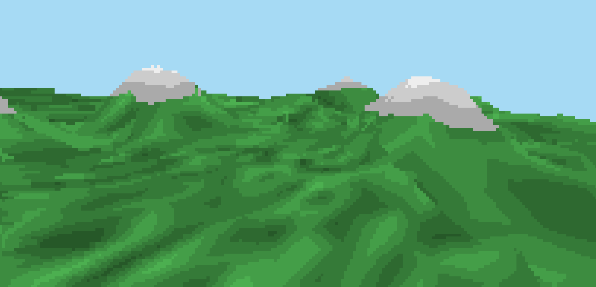
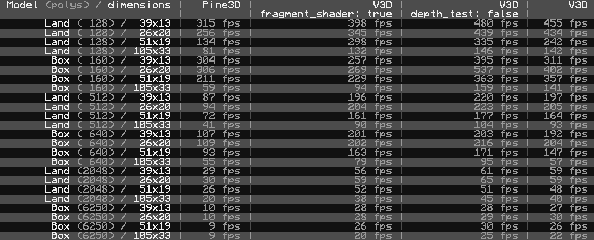

# V3D

3D rasterization library for ComputerCraft!

V3D lets you draw triangles in 3D with very good performance. The library
supports more advanced features like per-pixel depth testing, face culling,
fragment shaders, and perspective correct UV interpolation (that lets you use
textures).

The library is low-level and minimal, aimed at developers wanting to write high
performance 3D applications, or wanting to write a more general purpose and
capable 3D engine on top of a high performance 3D rasterization library.

## [Guides](https://github.com/exerro/v3d/wiki/Guides)

There are [guides](https://github.com/exerro/v3d/wiki/Guides) covering
everything from the basics to advanced features and concepts.

Here are a few you may be interested in.

* [Installation](https://github.com/exerro/v3d/wiki/Installation)
* [Quick Start](https://github.com/exerro/v3d/wiki/Quick-Start)
* [Hello Triangle](https://github.com/exerro/v3d/wiki/Hello-Triangle)

## [API reference](https://github.com/exerro/v3d/wiki/API-Reference)

## Benchmarking

I've included a pretty capable suite of benchmarking tools. Use
`v3d/benchmarking/run --help` for information.

The benchmarks offer comparison to another rendering library, Pine3D. I'm
planning on including C3D at some point too.

Here's some sample output.

## Rasterisation visualisation

The library uses a custom rasterization algorithm. You can interactively play
with the rasterizer using a Kotlin application.

Check out the [`raster_visuals`](./raster_visuals) folder for details!

