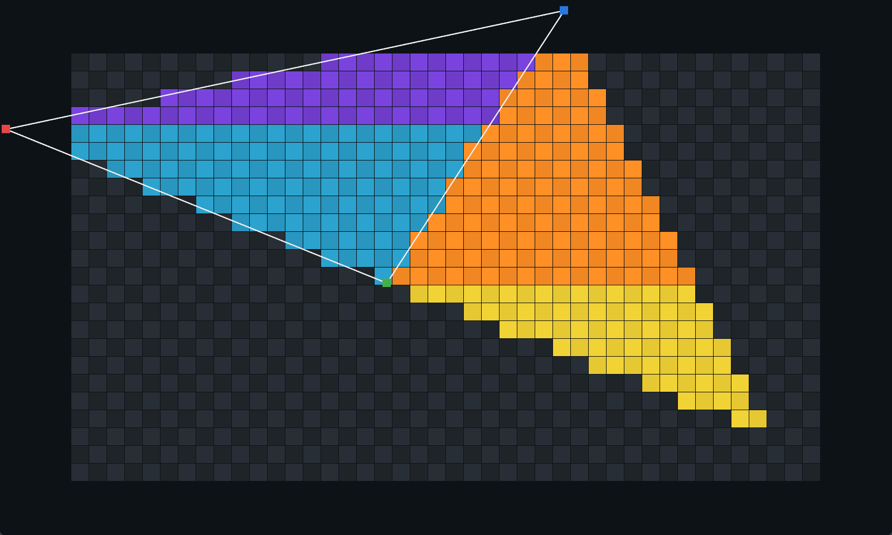

<h1 align="center">
  Raster Visuals
</h1>

Simple(ish) program to experiment with rasterisation algorithms.

The program creates a fixed-size window with 3 points that can be dragged
around. There's a virtual buffer that's drawn to. Each triangle is split into a
top and bottom half (with its own colour), and the main triangle denoted by the
draggable points is mirrored to form a second triangle (testing that seams
between triangles don't overlap/leave gaps.)



## How to run

Clone the repo, cd to this folder, and run `./gradlew run`.

```sh
git clone git@github.com:exerro/ccgl3d.git
cd ccgl3d/raster_visuals
./gradlew run
```

If you're not familiar with Gradle, this will download all the dependencies,
compile everything, and then run the application. The first run will take
significantly longer than subsequent ones.
